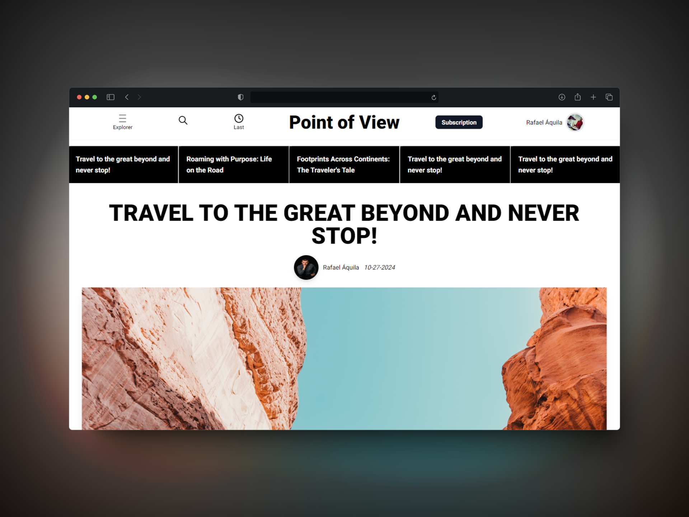

<p align="center">
   
</p>

<h1 align="center">
    <a href="#">Point of View</a>
</h1>

<p align="center">
    Point of View is a journalism project dedicated to presenting a unique perspective on global news, trends and stories and Columns on a variety of topics.
</p>

<p align="center">
  <a href="https://github.com/rafael-bit/PointOfView">
  	
  </a>
</p>

# 🚀 How function

Point of View seeks to delve deeper into relevant topics through analytical and impartial coverage, promoting an informed and critical view on various matters of public interest. The project brings articles, analyses and reports that help the reader understand the world from different perspectives.

## 👷 LocalHost

```bash
http://localhost:3000
```

#### Clone repository

```bash
git clone https://github.com/rafael-bit/PointOfView
```

#### Install the dependencies and run the project in development mode

```bash
npm install
npm run dev
```

Open the address in your browser: [http://localhost:3000](http://localhost:3000/)

# 💻 Technologies

[Next.js](https://nextjs.org/), [NextAuth](https://next-auth.js.org/), [Edgestore](https://edgestore.dev/), [Prisma](https://www.prisma.io/), [Tailwind CSS](https://tailwindcss.com/) e outros

# 🚩 Problems

Feel free to **report a new issue** with an appropriate title and description.

# 💡 Author

- Rafael Áquila ([@rafael-bit](https://github.com/rafael-bit))

# 🔧 Contributing

Check out Contribute to learn how to report issues, start discussions, and contribute to the project.